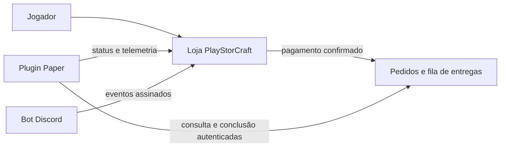

# PlayStorCraft

A **PlayStorCraft** é uma loja Minecraft auto-hospedada. O projeto reúne catálogo de VIP, Cash e Booster, checkout Mercado Pago, entrega automática no Paper, painel administrativo, integração Discord e telemetria operacional.

> **Segurança primeiro:** este repositório nunca contém senhas, tokens, chaves do Paper, backups de produção ou arquivos de runtime. Use os modelos versionados apenas como referência e crie os valores reais exclusivamente na VPS.

## Integração Site ↔ Minecraft Paper

Este repositório é o núcleo da integração entre a loja PlayStorCraft e o servidor Minecraft. A aplicação recebe a confirmação de pagamento pelo backend, cria entregas idempotentes e disponibiliza uma API autenticada para que o plugin Paper consulte, reivindique e confirme cada entrega sem repetir comandos. O bot Discord complementa a operação com status comunitário e eventos assinados, sem colocar tokens no frontend.



| Camada | Responsabilidade | Proteção aplicada |
| --- | --- | --- |
| Loja e API | Catálogo, pedidos, pagamento, cupons e fila de entregas | Validações no backend, auditoria e confirmação de webhook |
| Plugin Paper | Coleta e conclusão de entregas no servidor | Chave individual, reivindicação e conclusão idempotente |
| Bot Discord | Status comunitário, operações e vínculo Discord–Minecraft | Segredos no runtime e comunicação assinada |
| VPS | Aplicação, MySQL, Nginx e rotinas operacionais | HTTPS, rede interna Docker e backup verificável |

As instruções completas de instalação e operação estão em [docs/VPS_INSTALLATION_AND_OPERATIONS.md](docs/VPS_INSTALLATION_AND_OPERATIONS.md). Para a configuração do plugin e da API de entregas, consulte [docs/minecraft-plugin.md](docs/minecraft-plugin.md) e [docs/minecraft-api.md](docs/minecraft-api.md).

| Componente | Responsabilidade | Persistência |
| --- | --- | --- |
| Aplicação web | Loja, painel, pedidos, webhook e API de entregas | MySQL 8.4 |
| Nginx + Certbot | HTTPS, proxy reverso, cabeçalhos e cache | Configuração do host |
| Bot Discord | Convite, contagens e status da comunidade | Volume Docker próprio |
| Paper | Executa entregas e integra LuckPerms/economia | Arquivos do servidor Minecraft |

## Início rápido para uma nova VPS

O procedimento principal de instalação e operação está em **[docs/VPS_INSTALLATION_AND_OPERATIONS.md](docs/VPS_INSTALLATION_AND_OPERATIONS.md)**. Ele cobre preparação da VPS, Docker, runtime privado, Nginx, DNS, HTTPS, Mercado Pago, Discord, Paper, atualização, backup, restauração e rollback. O [runbook de migração](docs/vps-migration-runbook.md) detalha o corte entre VPSs.

| Documento | Finalidade |
| --- | --- |
| [Guia completo de VPS](docs/VPS_INSTALLATION_AND_OPERATIONS.md) | Instalação, configuração, operação, atualização, backup, restauração e rollback. |
| [Guia de migração para VPS](docs/vps-migration-runbook.md) | Transferência entre VPSs, corte de DNS, recuperação e validação. |
| [Modelo de runtime](deployment/vps/runtime.template) | Lista completa de variáveis sem valores reais. |
| [Backup da VPS](deployment/vps/backup-playstorcraft.sh) | Gera dump MySQL, cópia de assets, estado do bot e manifesto de integridade. |
| [Verificação da VPS](deployment/vps/verify-playstorcraft.sh) | Confere serviços, HTTPS, cabeçalhos e rotas operacionais. |
| [Plugin Paper](docs/minecraft-plugin.md) | Instalação e configuração da entrega automática. |
| [Integração Discord](docs/discord-bot-bridge.md) | Ponte assinada entre Discord, Paper e site. |

## Comandos de desenvolvimento

```bash
corepack enable
pnpm install --frozen-lockfile
pnpm check
pnpm test
pnpm run dev
```

Para produção, a composição em [`deployment/vps/docker-compose.yml`](deployment/vps/docker-compose.yml) usa Node 22, MySQL 8.4 e redes internas. O banco não é publicado na internet; apenas a aplicação é exposta localmente em `127.0.0.1:3000` para o Nginx.

## Informações operacionais importantes

As aprovações de pagamento chegam por webhook assinado; retornar do checkout **não** libera itens. O Paper coleta entregas autenticadas e as conclui de forma idempotente. Durante a migração, mantenha somente uma instância do bot Discord ativa e gere uma nova chave individual para cada servidor Paper criado no novo ambiente. Consulte o guia de migração antes de transferir qualquer arquivo de produção.

## Licença e informações sensíveis

Não publique `.env`, `/root/playstorcraft-runtime`, `config.yml` do plugin já preenchido, dumps, tokens de Mercado Pago, token do Discord, certificados ou chaves de servidor. Revogue e rotacione segredos se houver qualquer suspeita de exposição.
